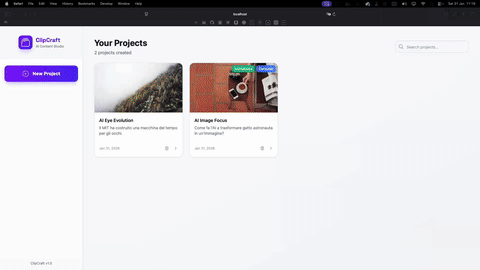

# ClipCraft

AI-powered content generation platform for TikTok scripts, carousel posts, and animated social media content.

[](https://github.com/SilvioBaratto/clipcraft/actions/workflows/ci.yml)
[](https://github.com/SilvioBaratto/clipcraft/actions/workflows/docker.yml)
[](LICENSE)
[](https://nestjs.com/)
[](https://angular.dev/)
[](https://www.postgresql.org/)
[](https://www.prisma.io/)
[](https://tailwindcss.com/)
[](https://www.typescriptlang.org/)
[](https://docs.docker.com/compose/)

<p align="center">
  
</p>

## Features

- **TikTok Script Generation** - Create engaging scripts with hooks, body, and call-to-action
- **Carousel Posts** - Generate multi-slide carousel content for social media
- **Animated Content** - Produce animated social media visuals
- **Multi-Provider AI** - Switch between OpenAI, Anthropic, and Google via [BAML](https://www.boundaryml.com/)
- **Swagger API Docs** - Interactive API documentation out of the box
- **Project Workflow** - Organize content into projects with full CRUD operations

## Architecture

```
Angular 21 (Tailwind CSS)
        |
      Nginx
        |
  NestJS 10 (BAML)
        |
  PostgreSQL 16 (Prisma)
```

## Prerequisites

- **Node.js** >= 22
- **Docker** + Docker Compose (recommended)
- **PostgreSQL** 16 (only if running without Docker)

## Quick Start (Docker)

```bash
git clone https://github.com/SilvioBaratto/clipcraft.git
cd clipcraft
cp .env.example .env
# Add your AI provider API keys to .env
docker compose up --build
```

| Service   | URL                          |
|-----------|------------------------------|
| Frontend  | http://localhost:3000         |
| API       | http://localhost:3001         |
| Swagger   | http://localhost:3001/api/docs |
| Adminer   | http://localhost:8090         |

## Development Setup

### API

```bash
cd api
npm install
cp .env.example .env
# Add your API keys to .env and configure DATABASE_URL
npx prisma migrate dev
npm run start:dev
```

### Frontend

```bash
cd frontend
npm install
npm start
```

The frontend runs at `http://localhost:4200` and proxies API requests to `http://localhost:3001`.

## Environment Variables

| Variable | Description | Required |
|----------|-------------|----------|
| `PORT` | API server port (default: `3001`) | No |
| `NODE_ENV` | Environment (`development` / `production`) | No |
| `OPENAI_API_KEY` | OpenAI API key | At least one AI key |
| `ANTHROPIC_API_KEY` | Anthropic API key | At least one AI key |
| `GOOGLE_API_KEY` | Google AI API key | At least one AI key |
| `CORS_ORIGIN` | Allowed CORS origins (comma-separated) | No |
| `DATABASE_URL` | PostgreSQL connection string | Yes |

## API Documentation

Once the API is running, visit the interactive Swagger UI at [`/api/docs`](http://localhost:3001/api/docs).

## Project Structure

```
clipcraft/
├── api/                    # NestJS backend
│   ├── baml_src/           # BAML AI function definitions
│   ├── prisma/             # Database schema & migrations
│   └── src/
│       ├── modules/        # Feature modules (projects, content, AI)
│       ├── common/         # Shared guards, filters, interceptors
│       └── config/         # App configuration
├── frontend/               # Angular frontend
│   └── src/
│       └── app/            # Components, services, pages
├── docker-compose.yml      # Full-stack Docker setup
└── .github/workflows/      # CI/CD pipelines
```

## Contributing

1. Fork the repository
2. Create a feature branch (`git checkout -b feature/my-feature`)
3. Commit your changes (`git commit -m 'Add my feature'`)
4. Push to the branch (`git push origin feature/my-feature`)
5. Open a Pull Request

Run `npm run lint` and `npm run test` in both `api/` and `frontend/` before submitting.

## License

This project is licensed under the MIT License - see the [LICENSE](LICENSE) file for details.

## Author

[Silvio Baratto](https://github.com/SilvioBaratto)
